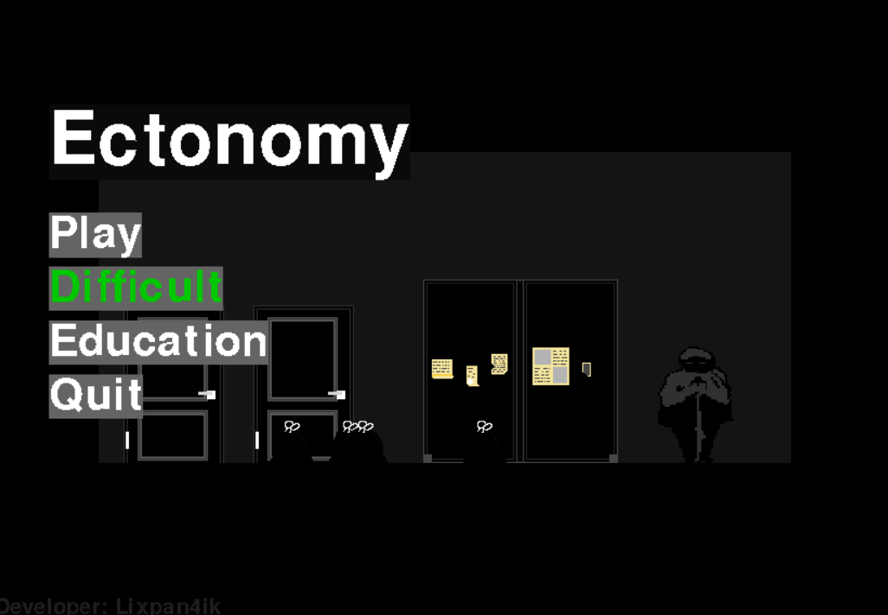
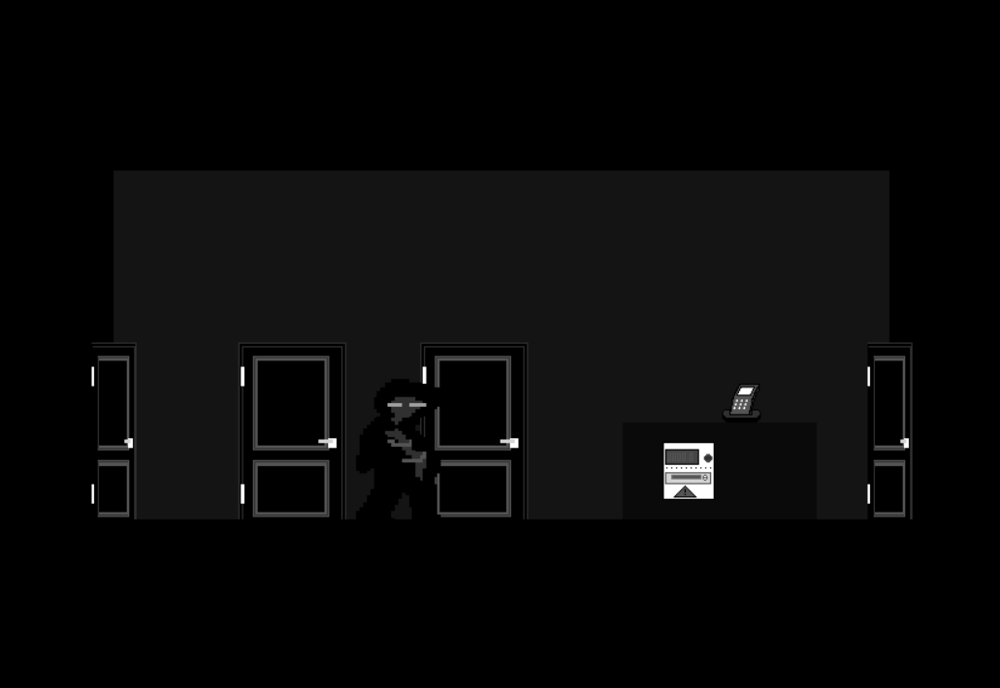
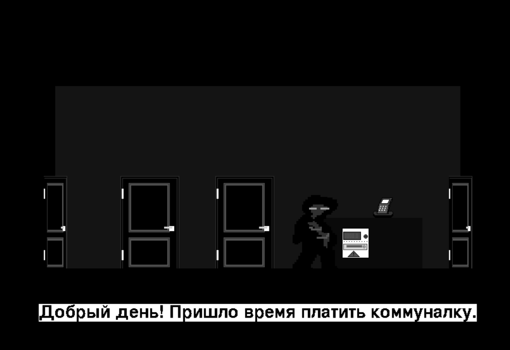
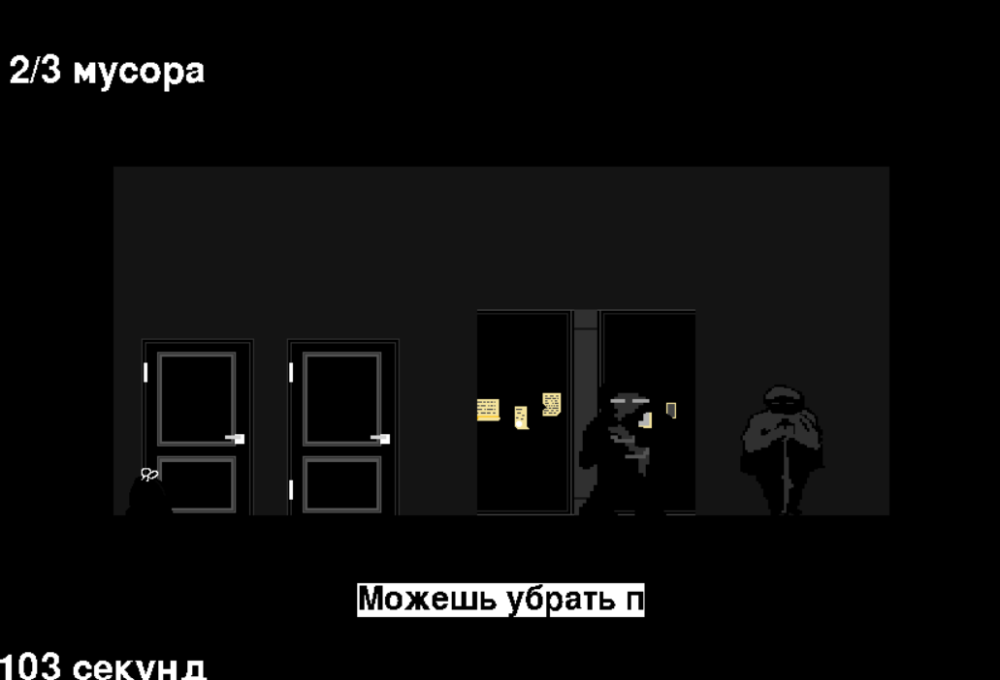
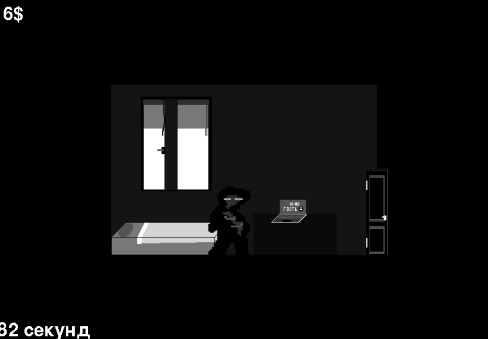
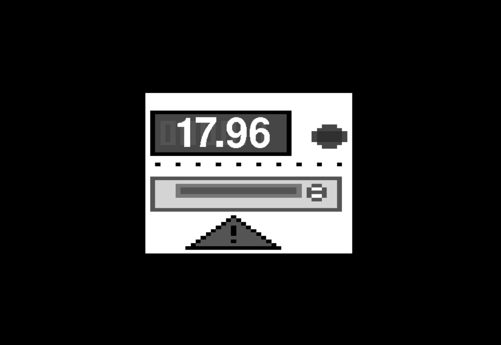

# Ectonomy
**Вы — обычный житель большого города, оказавшийся в сложной ситуации. На вас навалились долги за коммунальные услуги, и теперь вы должни их оплатить. У вас нет ни гроша в кармане, а время поджимает. Сможете ли вы справиться с такой ситуацией?**
*Игра моделирует реальную повседневную борьбу за выживание в условиях финансовых трудностей.*

# Управление
*[E]* - **Войти в дверь**

*[P]* - **Выйти в главное меню**

*[лкм]* - **Закрыть / выключить объект**

*[лкм]* - **Поднять звонок**

*[лкм]* - **Поговорить**

# Кадры из игры

